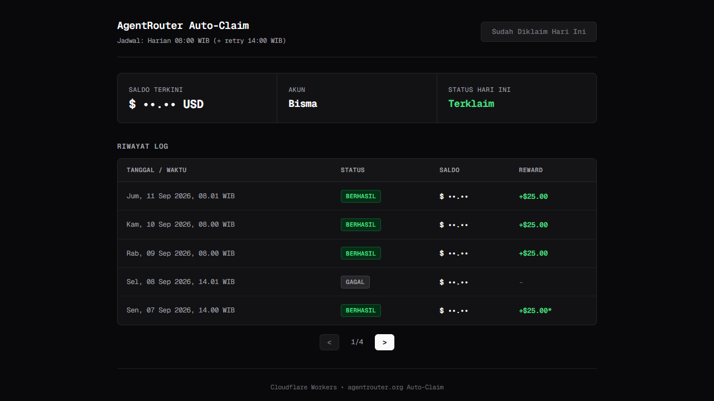

<div align="center">

# AgentRouter Daily

Auto-claim reward **$25 harian** [agentrouter.org](https://agentrouter.org) via **Cloudflare Workers** — cron trigger + Browser Rendering untuk menembus WAF, dengan dashboard web untuk memantau saldo & riwayat klaim.




</div>

## Fitur

- **Cron otomatis + retry:** klaim harian 08:00 WIB, diulang 14:00 WIB bila gagal. Setiap eksekusi diawali cek murah tanpa browser — kalau reward hari ini sudah aktif, langsung skip.
- **Sesi tersimpan (Durable Object):** cookie sesi disimpan setelah login sukses, jadi hari berikutnya cukup *quick check* 1 halaman tanpa login ulang.
- **Verifikasi reward nyata:** membandingkan saldo sebelum vs sesudah login — kenaikan ≥ $25 ditandai TERVERIFIKASI (`+$25.00` vs `+$25.00*` bila tidak terukur).
- **Browser Rendering (Playwright):** login via form Email/Password di Chromium sungguhan untuk melewati WAF Aliyun (request `fetch()` dari IP datacenter Cloudflare diblokir).
- **Dashboard web:** saldo terkini, akun, status hari ini, dan riwayat klaim — responsif di mobile.
- **100% gratis:** Workers Free Tier + free tier Browser Rendering (10 menit/hari, alur dirancang hanya memakai ±30 detik/hari).

## Setup & Deploy

1. Siapkan akun AgentRouter dengan password (belum punya? buka `agentrouter.org/login` → **Sign in with Email or Username** → **Forgot password?**).
2. Clone, install, dan login Cloudflare:

```bash
git clone https://github.com/bismawy/agentrouter-daily.git
cd agentrouter-daily
bun install            # atau: npm install
npx wrangler login
```

3. Simpan secret:

```bash
npx wrangler secret put AGENTROUTER_EMAIL      # email/username AgentRouter
npx wrangler secret put AGENTROUTER_PASSWORD   # password AgentRouter
npx wrangler secret put TRIGGER_AUTH_KEY       # opsional: kunci proteksi endpoint
```

4. Deploy:

```bash
bun run deploy
```

Binding `[browser]` dan Durable Object `[STATE]` sudah dikonfigurasi di `wrangler.toml` — dibuat otomatis saat deploy. Dashboard tersedia di `https://agentrouter-daily.<subdomain>.workers.dev`.

## Cara Kerja

```text
Cron 08:00 / 14:00 WIB
│
├─ Cek murah (tanpa browser): reward hari ini sudah aktif? → SELESAI (skip)
│
├─ Ada sesi tersimpan? ── QUICK CHECK (1 halaman browser, ±30 dtk)
│    ├─ reward sudah aktif → SELESAI ✅
│    └─ sesi mati → hapus sesi, lanjut login penuh
│
└─ LOGIN PENUH (Browser Rendering): form Email/Password →
     baca saldo → VERIFIKASI naik ≥ $25 →
     simpan sesi baru untuk besok → (fallback pure HTTP bila browser gagal)
```

## Endpoint

| Endpoint | Fungsi | Key? |
| :--- | :--- | :--- |
| `/` | Dashboard: saldo, akun, status, riwayat klaim | — |
| `/health` | Status worker & jadwal cron | — |
| `/trigger` | Jalankan klaim manual | 🔒 |
| `/api/history` | Riwayat klaim (JSON) | 🔒 |
| `/debug-browser` | Diagnosa alur browser ⚠️ habiskan kuota Browser Rendering | 🔒 |
| `/clean-history` | Kosongkan riwayat log | 🔒 |

🔒 = wajib `?key=<TRIGGER_AUTH_KEY>` bila secret tersebut disetel.

## Troubleshooting

- **"Login ditolak AgentRouter"** → tes login manual di agentrouter.org, lalu perbarui secret yang salah.
- **"Kuota Browser Run habis (429)"** → tunggu reset 00:00 UTC (07:00 WIB); retry cron akan mencoba lagi otomatis.
- **`+$25.00*`** → reward hari itu sudah diklaim sebelumnya (mis. login manual Anda). Normal, tidak perlu tindakan.
- **Error `10072` saat deploy** → Workers Free membatasi 5 cron trigger per akun; worker ini memakai 2 slot, kurangi cron worker lain.
- **Masih buntu?** → `npx wrangler tail` saat trigger, atau buka `/debug-browser` untuk diagnosa step-by-step.

## Developer

Developed and maintained by [Bisma](https://github.com/bismawy).
